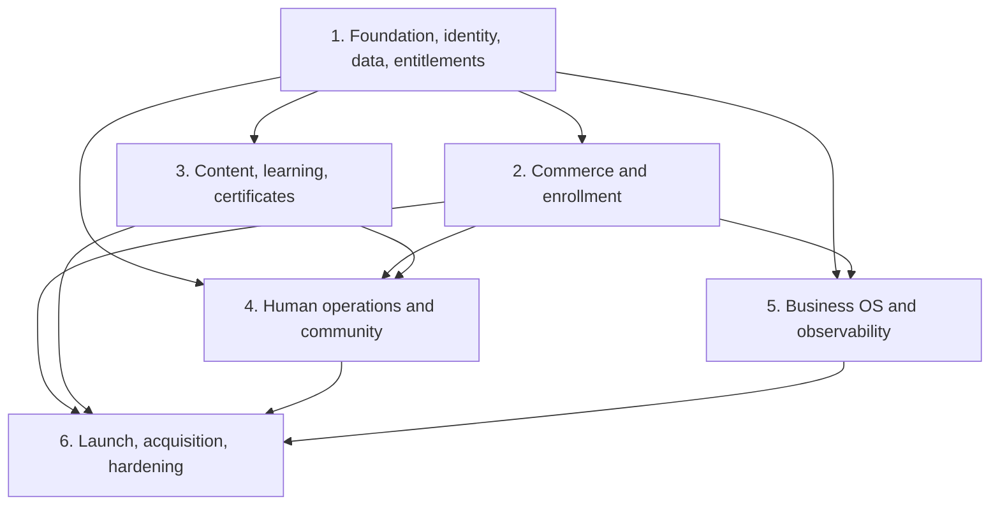

# Syntholo Production Program Implementation Plan

> **For agentic workers:** REQUIRED SUB-SKILL: Use superpowers:subagent-driven-development (recommended) or superpowers:executing-plans to implement this plan task-by-task. Steps use checkbox (`- [ ]`) syntax for tracking.

**Goal:** Replace the deterministic Syntholo demo with a production platform for 50–250 customer businesses while preserving the approved interface, completing all 18 lessons before payments open, and enforcing the approved identity, access, money, achievement, and Business OS boundaries.

**Architecture:** Migrate the existing Next.js application into an npm-workspace monorepo with independently deployable web, Fastify API, and PostgreSQL-backed worker processes. Keep all business writes in the API, all durable side effects in the worker, all access decisions in the entitlement authority, and all customer data in Neon PostgreSQL. Execute the six focused plans below in dependency order and release only through the six approved gates.

**Tech Stack:** Next.js 16.3, React 19.2, TypeScript 5.9, Fastify 5, Zod 4, Drizzle ORM and PostgreSQL/Neon, Clerk, WorkOS AuthKit, Stripe, Mux, Resend, Vercel Blob, Circle, PostHog, Sentry, Vitest, Testing Library, Playwright, axe-core, Vercel, and Railway.

## Global Constraints

- Keep the approved visual system and current route experience unless a focused plan explicitly changes a production behavior.
- Use Clerk only for public/member identity and WorkOS only for coach/admin identity; never merge or silently translate the sessions.
- Put every customer-owned row under immutable `accountId`; enforce scoped repositories and PostgreSQL RLS for the member runtime role.
- Compute access only through `packages/domain/src/entitlements`; UI flags and provider status never grant access directly.
- Treat course completion and certificates as immutable achievement facts, never entitlement grants.
- Keep HighLevel isolated: no SSO, shared session, API credential, worker pipe, or mirrored customer data.
- Claim provider events and command idempotency keys before mutation; write domain mutations, audit records, and outbox events in one transaction.
- Production must fail closed and show typed degraded states; it must never read demo fixtures after a database or vendor failure.
- Keep Academy payment creation disabled until the automated and human 18-lesson gate passes.
- Read the relevant Next.js 16 guide under `node_modules/next/dist/docs/` before changing App Router code, as required by `AGENTS.md`.
- Each task follows RED → GREEN → focused regression → self-review → commit. Do not combine tasks into one commit.
- Do not start a downstream plan until its listed entry criteria pass on the integration branch.

---

## Canonical Repository Map

```text
syntholo/
├── apps/
│   ├── web/
│   │   ├── src/app/                 # public, member, coach, admin routes
│   │   ├── src/components/          # visual primitives and shells
│   │   ├── src/features/            # browser/server UI orchestration only
│   │   ├── src/lib/api/             # typed API client and server token forwarding
│   │   └── tests/e2e/                # cross-surface browser journeys
│   ├── api/
│   │   └── src/
│   │       ├── app.ts               # Fastify composition
│   │       ├── auth/                # Clerk and WorkOS verification
│   │       ├── routes/              # public/member/staff/webhook route adapters
│   │       └── modules/             # use cases; no vendor SDK imports
│   └── worker/
│       └── src/
│           ├── runner.ts            # concurrent durable job claims
│           ├── cron.ts              # scheduled job enqueueing
│           └── handlers/            # idempotent side-effect handlers
├── packages/
│   ├── contracts/src/               # Zod request/response/event schemas
│   ├── domain/src/                  # pure rules and state machines
│   ├── database/src/                # Drizzle schema, scoped repositories, migrations
│   ├── integrations/src/            # provider ports and concrete adapters
│   └── testing/src/                 # factories, auth tokens, database helpers
├── infra/
│   ├── docker-compose.test.yml      # disposable PostgreSQL and ClamAV
│   ├── railway/                     # API and worker service configuration
│   └── scripts/                     # release-gate and recovery checks
└── docs/
    ├── architecture/                # decisions and authorization matrix
    ├── operations/                  # launch, support, restore, and incident runbooks
    └── superpowers/plans/           # executable implementation plans
```

## Canonical Cross-Plan Interfaces

The foundation plan creates these interfaces. Later plans import them rather than defining equivalents.

```ts
// packages/domain/src/identity/actor.ts
export type MemberActor = Readonly<{
  kind: "member";
  actorId: string;
  clerkUserId: string;
  accountId: string;
  membershipId: string;
  role: "owner" | "teammate";
  authenticatedAt: Date;
}>;

export type StaffActor = Readonly<{
  kind: "staff";
  actorId: string;
  workosUserId: string;
  staffId: string;
  role: "coach" | "admin";
  permissions: readonly string[];
  authenticatedAt: Date;
}>;

export type Actor = MemberActor | StaffActor;
```

```ts
// packages/domain/src/entitlements/types.ts
export type GrantCapability =
  | "academy_course"
  | "support"
  | "circle_write"
  | "operator_club"
  | "business_os";

export type GrantStatus = "active" | "grace" | "expired" | "refunded" | "revoked";
export type HoldKind = "commerce" | "seat_changes" | "business_os_activation";

export type EffectiveAccess = Readonly<{
  accountId: string;
  capabilities: Readonly<Record<GrantCapability, boolean>>;
  holds: readonly HoldKind[];
  seatLimit: 3;
  reservedSeats: number;
  explanations: readonly { capability: GrantCapability; sourceGrantIds: readonly string[] }[];
}>;

export function evaluateEntitlements(input: {
  accountId: string;
  now: Date;
  grants: readonly EntitlementGrant[];
  holds: readonly AccountHold[];
  seats: readonly SeatReservation[];
}): EffectiveAccess;
```

```ts
// packages/contracts/src/content/readiness.ts
export type ContentLaunchReadiness = Readonly<{
  requiredLessons: 18;
  readyLessons: number;
  contentHash: string;
  automatedPassedAt: string | null;
  humanApprovedAt: string | null;
  canSellAcademy: boolean;
}>;

// packages/contracts/src/commerce/offers.ts
export type OfferCode =
  | "scorecard"
  | "guided_pilot"
  | "self_paced"
  | "operator_club_monthly"
  | "operator_club_annual"
  | "business_os";
```

```ts
// packages/contracts/src/http.ts
export const ApiErrorSchema = z.object({
  error: z.object({
    code: z.string(),
    message: z.string(),
    correlationId: z.string().uuid(),
    details: z.record(z.string(), z.unknown()).optional(),
  }),
});

export type RequestContext = Readonly<{
  correlationId: string;
  idempotencyKey?: string;
  actor?: Actor;
}>;
```

```ts
// packages/database/src/unit-of-work.ts
export interface UnitOfWork {
  transaction<T>(run: (tx: TransactionContext) => Promise<T>): Promise<T>;
}

export interface TransactionContext {
  audit: AuditRepository;
  outbox: OutboxRepository;
  entitlements: EntitlementRepository;
  // Domain repositories are added by the owning focused plan.
}

export async function withAccountScope<T>(
  db: Database,
  accountId: string,
  run: (tx: DatabaseTransaction) => Promise<T>,
): Promise<T>;
```

```ts
// packages/domain/src/events.ts
export type DomainEvent<TType extends string, TPayload> = Readonly<{
  eventId: string;
  type: TType;
  aggregateId: string;
  accountId: string | null;
  occurredAt: string;
  payload: TPayload;
  schemaVersion: 1;
}>;
```

Every event name uses past tense and a version suffix, for example `commerce.purchase_fulfilled.v1`. Consumers must persist the event ID before applying a side effect. A later schema requires a new version; existing payloads are never reinterpreted.

## Plan Dependency Map



## Focused Execution Plans

1. [Production foundation](./2026-08-13-production-foundation.md) — monorepo migration, contracts, PostgreSQL/RLS, API/worker runtime, dual identity, audit/outbox, entitlement authority, and base CI/deployability.
2. [Commerce and enrollment](./2026-08-13-commerce-enrollment.md) — offers, attribution capture, Scorecard/Pilot persistence, Stripe Checkout/Billing, claims, seats, cohorts, Operator Club, refunds, disputes, and access recomputation.
3. [Content, learning, and certificates](./2026-08-13-content-learning-certificates.md) — versioned admin content, Mux readiness, member progress, shared artifacts, immutable achievements, private certificate PDFs, and the 18-lesson payment gate.
4. [Human operations and community](./2026-08-13-human-operations-community.md) — shared support, coach assignment and SLA, artifact review lock, safe attachments, sessions, reminders, and Circle access sync.
5. [Business OS and observability](./2026-08-13-business-os-observability.md) — seven-check activation, monthly verification, incidents, notifications, analytics, monitoring, and explicit HighLevel isolation.
6. [Launch, acquisition, and hardening](./2026-08-13-launch-acquisition-hardening.md) — native funnels, consent/UTM, legal copy, security controls, CI/CD, recovery, cross-system E2E, controlled production validation, and acquisition release.

## Approved-Spec Coverage Audit

| Approved addendum requirement | Owning task(s) |
|---|---|
| Launch offers, pricing, entry rules, and all-18-before-payment | Commerce 1/3; Content 9; Launch 10 |
| Monorepo and independent web/API/worker deployables | Foundation 1/2/5/9 |
| Public/member/coach/admin surfaces and Clerk/WorkOS split | Foundation 6; Launch 3 |
| Production API as sole business-write authority and stable errors | Foundation 2/5; Launch 9 |
| PostgreSQL-only system of record, RLS, scoped repositories | Foundation 3/4/9; Launch 9 |
| Audit, outbox, job retry/dead-letter, idempotency | Foundation 3/7; Business OS 6/8 |
| Central composable entitlements, holds, seats, explanation | Foundation 8; Commerce 6/8/9 |
| Personal progress and certificate achievement separation | Content 5/6/8 |
| Flow 1 Self-Paced purchase, claim, and seats | Commerce 3–6/10 |
| Flow 2 Pilot application, cohort, private checkout | Commerce 2/3/4/7/10 |
| Flow 3 account support, coach SLA, artifact review lock | Human Operations 1–5/10 |
| Flow 4 content publication, learning, completion, certificate | Content 1–10 |
| Flow 5 Operator Club and independent Business OS | Commerce 8; Business OS 1–5 |
| Flow 6 refunds, cancellation, failure, dispute | Commerce 9/10; Launch 2 |
| Safe uploads and private signed downloads | Human Operations 6; Content 8 |
| Native scheduling, manual Zoom, explicit automation triggers | Human Operations 7/8 |
| Circle SSO/access sync with no content mirroring | Human Operations 9/10 |
| Business OS seven checks, monthly recheck, degradation/triggers | Business OS 1–5/9 |
| Vendor topology and isolated environments | Launch 5/6 |
| Security, privacy, retention, export/deletion, legal approval | Launch 2–4/8 |
| Failure isolation, restore, rollback, RPO/RTO | Launch 7/10/11 |
| Native attribution, consent, KPIs, capped acquisition | Commerce 2; Launch 1/12 |
| Full verification matrix and six ordered release gates | Every focused final task; Launch 5/10–12 |
| Removal of production demo paths and legacy MongoDB | Foundation 9; Launch 9 |
| External launch dependencies and current missing Git remote | Launch 2/6/10/11; gate evidence remains blocked until supplied |
| V1 exclusions and deferred Zoom/Business OS automation | Human Operations 8; Business OS 4; static boundary tests |

Self-review result: all addendum sections have an owning implementation task. The only intentionally unresolved inputs are the owner's 18 real lessons and the external legal, vendor, staffing, account, remote, and controlled-production evidence listed by the addendum; the release controller represents each as `blocked`, never as an engineering placeholder or assumed approval.

## Release Branch and Environment Strategy

- Create one integration branch from the current approved visual baseline: `codex/production-platform`.
- Implement each numbered task on a short `codex/<plan>-<task>` branch or isolated worktree, then merge only after the task's focused checks and plan-level regression pass.
- Use `local`, `test`, `staging`, and `production` configuration modes. Staging and production use separate Clerk, WorkOS, Stripe, Neon, Mux, Blob, Resend, Circle, PostHog, and Sentry resources.
- Use five `NOLOGIN` PostgreSQL capability roles: migration, RLS-constrained member API, audited staff API, signed-provider system API, and worker runtime. Member, staff, system, and worker use separate least-privilege login pools selected only after authorization; migrations use the dedicated direct owner connection.
- Attach one immutable `RELEASE_SHA` to web, API, worker, Sentry, health responses, and deployment annotations.

## Ordered Gate Evidence

### Gate 1 — Foundation

- [ ] Foundation plan test suite, cross-account denial suite, RLS integration suite, entitlement state/property suite, API health, and worker claim tests pass.
- [ ] Clerk tokens cannot enter staff routes; WorkOS sessions cannot enter member routes.
- [ ] Record the exact canonical host/callback/redirects, Clerk production instance/authorized party/audience, and WorkOS issuer/client/organization/singleton roles/permissions/MFA/session policy.
- [ ] Capture staging WorkOS token-schema evidence for `client_id` and `auth_time` without token material; assign the encryption-key owner and prove two-phase rotation/recovery.
- [ ] Prove deployed `/v1` proxy conformance for status, body, `Location`, `Set-Cookie`, `Cookie`, and `Authorization`, plus exact member/staff PostgreSQL runtime capability attestation.
- [ ] Web, API, and worker build independently and report the same release SHA.

### Gate 2 — Production workflows

- [ ] Commerce, content, operations, and Business OS focused plans pass their contract, integration, and browser journeys in staging.
- [ ] Duplicate webhook, refund, dispute, subscription grace, review-lock race, SLA, certificate, Circle retry, scan quarantine, and dead-letter cases pass.
- [ ] Browser-only demo state is disabled for every completed production route.

### Gate 3 — Complete curriculum

- [ ] The content-gate command proves exactly 18 required published lessons with ready Mux playback, captions, transcript, summary, action, resources, disclosures, and accessibility approval.
- [ ] A human curriculum approver signs the generated gate report.
- [ ] Academy Checkout remains disabled until both automated and human approvals exist.

### Gate 4 — Staging rehearsal

- [ ] Full lint, typecheck, unit, contract, PostgreSQL integration, E2E, accessibility, responsive, visual, and production builds pass.
- [ ] Restore, migration rollback, provider degradation, export/deletion, cancellation, and incident drills are recorded.
- [ ] Legal, refund, recurring billing, privacy, community, affiliate, and Business OS disclosures are approved.

### Gate 5 — Controlled production validation

- [ ] A low-value real Academy purchase, signed webhook, account claim, receipt, grant, refund, and grant reversal completes without deleting progress/audit.
- [ ] Alerts, job monitors, staff MFA, two-coach rotation, four Pilot sessions, Circle groups, and Business OS seven-check runbook pass.
- [ ] The release runs for 48 hours without an unresolved critical incident.

### Gate 6 — Public acquisition

- [ ] Enable Self-Paced Checkout and Guided Pilot application/private Checkout.
- [ ] Enable Operator Club only for qualifying accounts; enable Business OS only through its independent readiness flag.
- [ ] Start capped Meta/Instagram spend and review attribution, fulfillment, claims, activation, support SLA, refunds, and incidents daily.

## Program-Level Verification Commands

Run from the repository root after each focused plan and before each gate:

```bash
npm ci
npm run lint --workspaces --if-present
npm run typecheck --workspaces --if-present
npm run test --workspaces --if-present
npm run test:integration
npm run build --workspaces --if-present
npm run test:e2e
npm run gate:production
git diff --check
```

Expected: every command exits `0`; `gate:production` prints each gate as `PASS` or `BLOCKED` with no payment capability enabled while Gate 3 is blocked.

## Program Completion Commit

After all six plans and controlled production validation pass:

```bash
git add apps packages infra docs package.json package-lock.json
git commit -m "feat: launch Syntholo production platform"
```

Do not create this aggregate commit if task commits already cover the same changes; use it only for the final gate evidence and release metadata.
